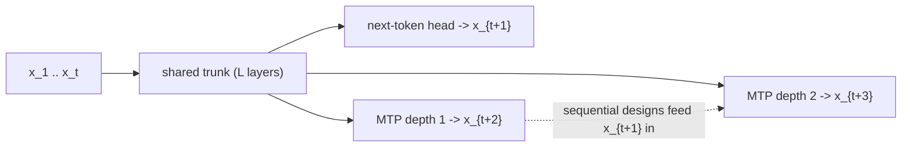
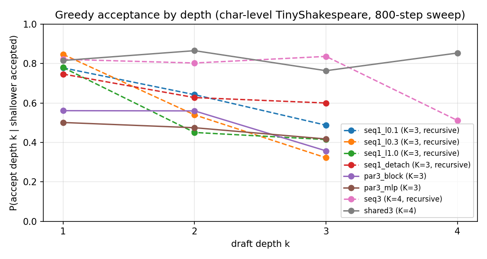

# Awesome MTP: Multi-Token Prediction, from the papers to a working framework

> A tutorial repository. Part I (this README) is a map of the field as of late 2026: what
> multi-token prediction is, where it came from, every head design that matters, what it buys
> you at training and at inference, which production models ship it, and what is still open.
> Part II (`tutorials/`) rebuilds the core ideas from scratch. Part III (`mtp/`) is the small,
> tested framework the tutorials produce, and the base we keep extending toward a comprehensive
> MTP toolkit. The early chapters are deliberately gentle; the hard parts (EAGLE-style feature
> drafting, tree verification, RL interaction, loading real checkpoints, serving) come next.

[](https://github.com/ysjprojects/awesome-mtp/actions/workflows/tests.yml)

**Status:** Part I written. Chapters 01-05 and the framework they build are complete and
tested (`pytest`: 31 tests, including an exact lossless-decoding check against greedy search).
Chapters 06-12 are planned; see [the roadmap](#12-the-tutorial-roadmap-and-status).

---

## Contents

1. [What multi-token prediction is](#1-what-multi-token-prediction-is)
2. [A short history](#2-a-short-history)
3. [A taxonomy for reading MTP papers](#3-a-taxonomy-for-reading-mtp-papers)
4. [The two payoffs, with numbers](#4-the-two-payoffs-with-numbers)
5. [Head designs in depth](#5-head-designs-in-depth)
6. [Training recipes and pitfalls](#6-training-recipes-and-pitfalls)
7. [MTP in production models](#7-mtp-in-production-models)
8. [Inference-engine and training-stack support](#8-inference-engine-and-training-stack-support)
9. [Adjacent paradigms and where the boundary is](#9-adjacent-paradigms-and-where-the-boundary-is)
10. [Reading list](#10-reading-list)
11. [Open problems](#11-open-problems)
12. [The tutorial: roadmap and status](#12-the-tutorial-roadmap-and-status)
13. [Quickstart](#13-quickstart)
14. [Glossary, and how to read a model card's MTP line](#14-glossary-and-how-to-read-a-model-cards-mtp-line)
15. [FAQ](#15-faq)

---

## 1. What multi-token prediction is

A standard causal language model reads a prefix `x_1..x_t` and is trained to predict `x_{t+1}`:

```
L_ntp = - sum_t log P_theta(x_{t+1} | x_{<=t})
```

Multi-token prediction (MTP) keeps that objective and adds, at every position, predictions of
tokens further ahead. With `D` extra depths, the representation at position `t` also has to
predict `x_{t+2}, ..., x_{t+1+D}`:

```
L = L_ntp + (lambda / D) * sum_{k=1..D} L_k,      L_k = - sum_t log P_theta^{(k)}(x_{t+1+k} | x_{<=t}, ...)
```

The trunk (the ordinary decoder) is unchanged and stays causal. What varies between papers is
the *head* `P^{(k)}`: a linear layer, a small MLP, a transformer block reading the trunk output,
or a chain of modules that also consumes the intermediate tokens. Section 5 covers each.

Two facts make MTP worth a whole tutorial rather than a footnote:

1. **It is a training-signal change.** Every position supplies `D + 1` targets instead of one.
   Gloeckle et al. (2024) showed this makes 7B-13B models measurably better at code generation
   and algorithmic tasks *with no change to inference*, and later theory (Section 4.1) explains
   part of why: the extra targets bias the model toward representations that "plan" ahead.
2. **It is a free draft model.** The heads propose `K` future tokens; the trunk verifies them all
   in one forward pass; accepted tokens come out together. This is speculative decoding
   (Leviathan et al. 2023; Chen et al. 2023) with the drafter built into the model. It is
   lossless: with greedy verification the output is token-for-token identical to greedy
   decoding, and with rejection sampling the output distribution equals the trunk's. Every
   production MTP deployment in Section 7 is this mechanism.

A naming wrinkle to keep straight: Gloeckle et al.'s `n = 4` means four predictions *in total*
(the ordinary next token plus three more). Model cards say "MTP-1" or "one MTP layer" to mean one
*additional* depth. This repository uses the second convention: `n_future = D` extra depths;
depth `k` reads position `t` and predicts `t + 1 + k`.



## 2. A short history

**Prehistory (2018-2023).** Stern, Shazeer and Uszkoreit's *Blockwise Parallel Decoding* (NeurIPS
2018) already contains the whole loop: extra output heads predict `k` tokens ahead from one
state, a verification pass keeps the longest agreeing prefix, and the authors note that heads can
be trained on a frozen model or jointly. Non-autoregressive translation (Gu et al. 2018,
Mask-Predict 2019) pursued fully parallel generation instead. ProphetNet (2020) trained
seq2seq models to predict future n-grams with an n-stream self-attention. Then speculative
decoding (Leviathan et al.; Chen et al., 2023) made draft-and-verify exact for *sampling*, not
just greedy search, and *Future Lens* (Pal et al. 2023) showed hidden states of GPT-J linearly
encode tokens several steps ahead. PaSS (Monea et al. 2023) drafted with learned lookahead
embeddings appended to the prompt, a direct ancestor of the mask-token methods of 2025.

**2024: the name and the two canonical designs.** Medusa (Cai et al., Jan) bolted residual-MLP
heads onto a frozen Vicuna and verified them with tree attention (2.2-3.6x). EAGLE (Li et al.,
Jan) drafted at the *feature* level, autoregressing over trunk hidden states plus token
embeddings, and became the strongest general-purpose draft design (EAGLE-2 with dynamic draft
trees; EAGLE-3 in 2025 with multi-layer features, up to 6.5x reported). Hydra made Medusa heads
sequentially dependent. In April, Gloeckle, Idrissi, Roziere, Grattafiori and Synnaeve's *Better
& Faster Large Language Models via Multi-token Prediction* (Meta, ICML 2024) fixed the
terminology and the first big claim: a 13B code model trained with four parallel heads solves
12% more HumanEval and 17% more MBPP problems, gains grow with scale, byte-level models benefit
most, and the heads give up to 3x faster self-speculative decoding. Bachmann and Nagarajan's
*The Pitfalls of Next-Token Prediction* (ICML 2024) supplied the cautionary theory: on a star
graph path-finding task, teacher-forced NTP fails where multi-token / teacherless objectives
succeed. In December, DeepSeek-V3 turned MTP into production practice with a *sequential*
module (a depth that sees the true `x_{t+1}` before predicting `x_{t+2}`), used it as an
auxiliary loss through pre-training, and reported 85-90% second-token acceptance and 1.8x
decoding throughput when the module is reused as a drafter.

**2025: variants, theory, and adoption.** MiMo-7B (Xiaomi, May) pre-trained with MTP for
reasoning; MuToR (May) replaced heads with interleaved register tokens so fine-tuning needs no
architectural change; L-MTP (May) predicted *non-adjacent* future tokens; a pre-training
curriculum paper (ACL) showed small models need NTP-first schedules; JTP (Ahn, Lamb, Langford)
argued for a representation bottleneck so the trunk encodes a short-horizon belief state;
*Roll the Dice & Look Before You Leap* (ICML 2025 outstanding paper) tied multi-token training
to creativity. Apple's *Your LLM Knows the Future* (Jul) fine-tuned mask tokens plus gated LoRA
and a sampler head onto Tulu-3-8B for ~5x on code/math and ~2.5x on chat. Token Order
Prediction (Aug) replaced exact future-token targets with a ranking loss. Production adoption
went wide: GLM-4.5 (Jul), ERNIE 4.5 (Jun), LongCat-Flash (Sep, dense MTP head, >90%
acceptance), Qwen3-Next (Sep, MTP trained for multi-step drafting), Ling 2.0 (Oct, one MTP
layer, weight 0.1), MiMo-V2-Flash (Dec, three MTP layers, acceptance length 3.6, 2.6x). FastMTP
(Tencent, Sep) trained a single position-shared head on self-distilled data (2.03x average).
Set Block Decoding (Meta, Sep) and CALM (Oct) explored neighbours: masked parallel decoding
inside an AR model, and predicting continuous vectors instead of tokens. *Beyond MTP: Future
Summaries* (Oct, ICLR 2026) argued MTP mostly captures short-range structure and proposed
predicting a summary of the long-range future. Parallel Token Prediction (Dec, ICLR 2026)
moved randomness to the input so that several tokens can be sampled *jointly* in one call.

**2026: MTP is table stakes.** GLM-5 (Feb) trains three MTP layers with *shared* parameters to
close the train/inference mismatch of recursive drafting (acceptance length 2.76 vs. 2.55 for
DeepSeek-V3.2 at equal steps). Step 3.5 Flash ships MTP-3 with a sliding-window-attention +
dense-FFN head. Nemotron 3 Super (Mar) uses a shared-weight head applied recursively. Gemma 4
(Apr) gives *every* size, including the 2B/4B edge models, a dedicated MTP drafter: a 4-layer
block that cross-attends to the main model's KV cache (so no separate draft prefill), sharing
the input embedding, with a clustered top-k vocabulary projection on the small models; Google
reports up to ~3x. DeepSeek-V4 (Apr) keeps one MTP module. Qwen3.5/3.6/3.8 ship native MTP that
llama.cpp (merged May 16), mlx-lm and Hugging Face Transformers now run. Kimi K3 (Jul)
pre-trains an MTP layer and fine-tunes it into an EAGLE-3-style drafter. MiniMax-M2 expands
from one to three modules during the decay phase of pre-training. On the research side: MTP via
self-distillation converts a pretrained NTP model into a standalone multi-token decoder (>3x at
<5% GSM8K drop; ICML 2026); ESP does training-free MTP by probing with mask embeddings (ICML
2026); K-Forcing distils an AR teacher into a push-forward map that emits `k` tokens jointly;
Windowed-MTP removes the draft head's full-attention "KV tax" at million-token context;
AdaMTP adapts the horizon to entropy; theory papers (COLM 2026) prove MTP induces backward
planning circuits on graph tasks. And RL met MTP: acceptance rates collapse as policy entropy
rises during RL (Bebop, Qwen, Jun), joint MTP+RL training needs calibrated loss coefficients
(OCC, May), and several systems (SPEC-RL, SpecRoll, EfficientRollout) use speculative or
self-speculative rollouts to speed up on-policy training.

## 3. A taxonomy for reading MTP papers

Five questions place any method in the design space.

| Axis | Options (representative methods) |
|---|---|
| **What does depth `k` read?** | trunk state only (Gloeckle, Medusa, MuToR registers); trunk state + the true/drafted intermediate tokens (DeepSeek-V3, Hydra, Qwen3-Next, GLM-5); its own previous features (EAGLE-1/2/3, Kimi K3 drafter); masked/probe inputs to the trunk itself (Apple gated-LoRA, ESP, PaSS); the main model's KV cache via cross-attention (Gemma 4) |
| **How heavy is the head?** | a linear/MLP layer (Medusa, TOP's extra unembedding); one transformer block per depth (Gloeckle, DeepSeek-V3, Ling); a shared block reused recursively (Nemotron 3 Super, GLM-5, FastMTP); a multi-layer mini-decoder (Gemma 4, EAGLE-3); no new weights at all (ESP, MuToR) |
| **When is it trained?** | from the start of pre-training (Gloeckle, DeepSeek, Ling, MiMo); added in a mid-training/decay phase (MiniMax-M2); post-hoc on a frozen model (Medusa-1, Apple, FastMTP, Kimi K3's EAGLE-3 conversion); by self-distillation from the model's own samples (FastMTP, Kirchenbauer et al., K-Forcing, PTP) |
| **How is it used at inference?** | discarded (pure training signal); greedy verify; rejection sampling (lossless sampling); tree verification of several candidates per depth (Medusa, EAGLE-2, ESP); standalone parallel decoding without a verifier (self-distilled MTP, K-Forcing, Apple's quadratic expansion + sampler) |
| **What exactly is predicted?** | the next `k` tokens (most); non-adjacent "leap" tokens (L-MTP); bytes/byte groups (Gloeckle 8-byte, probabilistic circuits, dynamic multi-byte); a joint sample of `k` tokens (PTP, K-Forcing, tensor-decomposed heads); the *order* of upcoming tokens (TOP); a summary of the long-range future (FSP); a latent vector for a chunk (CALM, PIPO) |

The single most important distinction is the first one. Heads that read only the trunk state
predict `x_{t+2}` *marginally*, without knowing `x_{t+1}`; their drafts are independent given
the prefix and their acceptance rate falls quickly with depth. Sequential designs keep the full
causal factorisation `P(x_{t+2} | x_{<=t+1})` at the price of running depths one after another.
The tutorial implements both (chapters 02 and 03) so the difference can be measured.

## 4. The two payoffs, with numbers

### 4.1 Better models

*Evidence for.* Gloeckle et al.: at 13B, `n = 4` heads give +12% HumanEval and +17% MBPP over
NTP at equal compute; gains increase with model size (models under ~1B were often hurt on
benchmarks); MTP models learn induction heads and algorithmic tasks faster; byte-level models
with 8-byte prediction gain the most; and NTP fine-tuning of an MTP-pretrained model is as good
or better than NTP-pretrain + NTP-finetune (CodeContests). DeepSeek-V3's ablations at 15.7B and
228.7B scale show MTP improving most benchmarks. Ling 2.0 reports consistent code and math gains
across scales with one MTP layer at weight 0.1. On synthetic planning tasks (star graphs,
Countdown, SAT) MTP beats NTP, and *How Transformers Learn to Plan via MTP* (COLM 2026) proves
in a two-layer model that the multi-token loss decouples gradients so the model learns to attend
to the goal first and reconstruct the path backward.

*Evidence against, or at least complicating.* Several groups report that MTP's gains do not
transfer to standard NLP benchmarks or to fine-tuning: Token Order Prediction (2025) finds exact
future-token targets "too difficult as an auxiliary loss" and beats NTP, MTP and DeepSeek-style
MTP at 340M-7B with a ranking objective; MuToR motivates registers by the failure of head-based
MTP in SFT; the curriculum paper shows small models need to start with NTP; *Future Summaries*
argues MTP captures mostly short-range dependencies. AdaMTP attributes part of the damage to
forcing heads to predict across high-entropy boundaries and masks those positions. The honest
summary in 2026: MTP as an auxiliary loss is a reliable win for code/math/reasoning at >1B
scale with a small `lambda`, is neutral-to-slightly-negative for tiny models and for some
knowledge benchmarks, and its representation benefit is partially achievable by cheaper
proxies (TOP, FSP).

### 4.2 Faster inference

The arithmetic. Let `alpha_k` be the probability that the depth-`k` draft is accepted given the
shallower drafts were. A round drafts `K` tokens, verifies them in one trunk forward, and emits
`1 + sum_{k<=K} prod_{j<=k} alpha_j` tokens in expectation (the `1` is the bonus token the verify
pass produces for free). Speedup is that number divided by the relative cost of a round, i.e.
`(1 + draft cost) / 1` if a verify pass costs the same as a normal decode step, which is true in
the memory-bound regime where reading the weights, not the `K + 1` tokens of compute, dominates.
Everything in practice is about keeping `alpha` high and the draft cheap:

| System | Draft design | Reported acceptance / speed |
|---|---|---|
| DeepSeek-V3 (2024) | 1 sequential module, used recursively | 85-90% 2nd-token acceptance; 1.8x TPS |
| Medusa (2024) | 5 MLP heads on frozen Vicuna, tree verify | 2.2x (Medusa-1) to 3.6x (Medusa-2) |
| EAGLE-3 (2025) | feature-level AR drafter, dynamic tree | up to 6.5x; 1.38x throughput at batch 64 in SGLang |
| DFlash (2026) | block-diffusion drafter conditioned on target features | >6x lossless; up to 2.5x over EAGLE-3 |
| Apple gated-LoRA (2025) | mask tokens + LoRA + sampler head | ~5x code/math, ~2.5x chat, no quality loss |
| FastMTP (2025) | 1 position-shared head, self-distilled, vocab compression | 2.03x avg, +82% over vanilla MTP |
| LongCat-Flash (2025) | single dense MTP head on a 560B MoE | >90% acceptance |
| MiMo-V2-Flash (2025) | 3 MTP layers | acceptance length 3.6; 2.6x |
| GLM-5 (2026) | 3 shared-parameter MTP layers | acceptance length 2.76 (vs 2.55 DeepSeek-V3.2) |
| Gemma 4 (2026) | 4-layer drafter cross-attending main KV | up to ~3x |
| Qwen3.6-27B via llama.cpp (2026) | native MTP | 38 -> 65 tok/s on an RTX 3090 (1.7x, community benchmark) |
| Bebop / Qwen (2026) | MTP with TV-loss + rejection sampling in RL | up to 95% acceptance, 1.8x end-to-end async RL |

Things that erode the gain, all of which recur in Section 11: MoE targets at batch size 1 (each
extra verified token may touch new experts; Google notes the 26B-A4B Gemma drafter may not help
there), long contexts where a full-attention draft head's KV read grows linearly (Windowed-MTP
measures +28-44% per-step cost for the shipping DeepSeek-style heads at 1M tokens), domain
shift between the drafter's training data and the request stream (multi-LoRA serving reports
degraded acceptance; RL raises entropy and lowers acceptance), and the train/inference mismatch
when a head trained for depth 1 is applied recursively at depth 2 and 3 (the reason GLM-5,
Nemotron 3 Super and FastMTP share and recursively train their heads). Chapter 05 reproduces
that last effect in miniature: three separate modules accept 51% of fourth-depth drafts when
the deepest one is reused, one module trained at three depths accepts 85%.

## 5. Head designs in depth

**Parallel heads (Gloeckle et al. 2024).** Trunk `f_s`, one transformer layer `f_{h_k}` per
depth, a shared unembedding `f_u`. All heads read `z_t = f_s(x_{<=t})`, so the `n` predictions
are computed in one pass and are conditionally independent. Memory: `n` logits tensors of size
`B x T x V` would dominate activations, so the forward *and backward* of each head is run in
turn, accumulating the gradient at `z`, before the trunk backward (implemented in
`mtp/loss.py::train_step`). Self-speculative decoding uses blockwise parallel decoding from the
heads. Chapter 02.

**Medusa heads (Cai et al. 2024).** Same topology, but each head is a zero-initialised residual
MLP (`x + SiLU(Wx)`) on the final normed state with its own unembedding, trained on a frozen
backbone (Medusa-1) or jointly with a small head-loss weight and a warmup (Medusa-2). Candidates
from the top-`k` of each head are verified together with a tree attention mask; a typical
acceptance scheme takes the longest candidate whose tokens fall within an entropy-dependent
threshold. In this repo `--kind parallel --head-arch mlp` reproduces the head design (with a
shared unembedding). Chapter 02.

**Sequential modules (DeepSeek-V3).** Depth `k` combines the previous depth's state with the
embedding of the token `k` steps ahead:

```
h'_k[t] = M_k [ RMSNorm(h_{k-1}[t]) ; RMSNorm(Emb(x[t + k])) ]      (M_k: 2d -> d)
h_k     = TransformerBlock_k(h'_k)                                    (causal over slots t)
P^{(k)}(x[t + 1 + k]) = softmax( Unembed( RMSNorm(h_k[t]) ) )
```

Embedding and unembedding are shared with the trunk; each depth owns `M_k`, the block and the
norms. During training `x[t + k]` is the ground-truth token (teacher forcing) and depth `k` is
computed for slots `0..T-1-k`; DeepSeek-V3 used `D = 1`, `lambda = 0.3` for the first 10T tokens
and `0.1` for the rest, and the same module for several recursive draft steps at inference.
Chapter 03 implements this exactly, including the slot bookkeeping and cache rewind that make
recursive drafting correct.

**Shared-weight recursive modules (Nemotron 3 Super, GLM-5, FastMTP).** Train one module at
several depths (GLM-5: three depths, one set of parameters; Nemotron 3 Super: two depths) so
that the module sees *its own* outputs as input during training, exactly as it will when drafting
recursively. This closes the mismatch that costs DeepSeek-style heads acceptance at depth >= 2
and keeps parameter and KV memory at the one-module level. `--kind sequential --share-weights
--n-future 3` in this repo. Chapter 03.

**Feature-level drafters (EAGLE-1/2/3; Kimi K3; HASS; Falcon).** The drafter is a one-layer
decoder that autoregresses over (trunk feature, token embedding) pairs and predicts the *next
feature*, from which the shared unembedding produces the token. EAGLE-2 grows a draft tree
sized by the drafter's confidence; EAGLE-3 drops the feature-regression loss and feeds
low/mid/high-layer features, training with simulated multi-step drafting ("training-time
test"). Kimi K3 pre-trains a DeepSeek-style MTP layer and then fine-tunes it into an EAGLE-3
drafter, which is the cleanest statement of how the two families relate. Planned for chapter 06.

**Cross-attending drafters (Gemma 4).** The MTP head is a 4-layer transformer (three local, one
global attention layer; width 256 for E2B/E4B, 1024 for 26B-A4B/31B) that takes the trunk's
last-layer activation and token embeddings and *cross-attends to the main model's KV cache*, so
the drafter needs no prefill of its own and can draft any length. For the edge models the full
vocabulary projection is replaced by a top-k over token clusters (`d x 262k` becomes `d x 4096`).

**Mask-token / probe designs (PaSS 2023; Apple 2025; ESP 2026).** Append `K` learned mask tokens
after the prompt and read `K` future predictions off their positions in one trunk pass. Apple
adds gated LoRA (the base path is untouched, so NTP outputs are bit-identical), a small sampler
MLP that conditions each future token on the previous sampled one, and a consistency loss;
ESP shows an untrained probe drawn from the embedding space already works because decoder
layers align mask states with next-token states. Planned for chapter 07.

**Registers (MuToR 2025).** Interleave learnable register tokens into the input; each register at
position `t` is trained to predict `x_{t+k}` and is masked out of the attention of ordinary
tokens, so the pretrained model's NTP path is untouched. No new heads, negligible parameters,
works for SFT, PEFT and pre-training, and extends to image generation. Planned for chapter 07.

**Joint-distribution heads.** Independent heads cannot represent dependencies between
`x_{t+1}` and `x_{t+2}`. Fixes: a rank-`r` canonical tensor decomposition of the joint over the
heads (Basharin et al. 2024), a representation bottleneck with teacher-forced future tokens
(JTP 2025), and *push-forward* models where independent noise inputs are mapped to a joint sample
of `k` tokens in one call (PTP, ICLR 2026; K-Forcing 2026, 2.4-3.5x at `k = 4` with modest quality
loss and no verifier). Planned for chapter 11.

**Byte-level MTP.** Gloeckle et al. found 8-byte prediction nearly doubles byte-level code
performance; probabilistic-circuit heads (ICML 2026) and dynamic multi-byte prediction with
hierarchical models (2026) make multi-byte outputs expressive and adaptive. Planned for chapter
11.

## 6. Training recipes and pitfalls

- **Target alignment.** Depth `k` at slot `t` targets `x_{t+1+k}`; the last `k` slots have no
  target. Off-by-one errors here silently train a useless head (`tests/test_loss.py` pins the
  contract).
- **Loss weight.** `lambda` in `[0.1, 0.3]` is the production range (DeepSeek-V3 0.3 -> 0.1; Ling
  2.0 0.1). Equal weighting hurts the main head. Medusa-2 uses a tiny head weight plus warmup.
- **Positions and caches.** A sequential depth `k` handles the token at `t + k` in slot `t`, so its
  rotary position is `t + k` and its KV cache is over *slots*. Drafting must feed depth `k` the
  same inputs training did, and rejected drafts must be rewound from every depth's cache and
  from the trunk cache. `tests/test_decode.py` compares the incremental drafter against a
  teacher-forced forward after several rounds of rewinds.
- **Memory.** Run heads one at a time with immediate backward (Gloeckle); for sequential chains
  detach between depths and back-propagate the chain in reverse (`mtp/loss.py`).
- **When to add heads.** From step 0 (most pre-trained MTP models); during a decay/mid-training
  phase (MiniMax-M2 adds two modules then); or post-hoc on a frozen model with self-distilled
  targets (FastMTP, Kirchenbauer et al.). Training a drafter on the model's *own* samples rather
  than corpus text is consistently worth 20-80% extra acceptance because that is the
  distribution it will be asked to continue.
- **Recursive use needs recursive training.** A depth-1 module used at depth 3 is out of
  distribution; share weights across depths and train at the draft length you will deploy
  (GLM-5, Nemotron 3 Super, FastMTP, Qwen3-Next's multi-step training).
- **Small models.** Under ~1B parameters MTP heads can hurt; use a forward curriculum (NTP then
  MTP), a smaller `lambda`, fewer depths, or a proxy objective (TOP).
- **RL.** Acceptance falls as policy entropy rises during RL; probabilistic rejection sampling
  beats greedy drafting there, and a loss that directly maximises multi-step acceptance
  (Bebop's TV loss) recovers ~10 points. Jointly training MTP and RL losses degrades the policy
  unless the coefficient is calibrated (OCC); detaching the head is the common compromise.
  slime and a verl fork support MTP updates during RL.
- **Measure the right thing.** Teacher-forced per-depth accuracy predicts greedy acceptance;
  acceptance length predicts tokens per step; only an end-to-end benchmark on your engine and
  batch size predicts wall-clock speedup.

## 7. MTP in production models

| Model (date) | MTP design | Notes |
|---|---|---|
| DeepSeek-V3 / R1 / V3.1 / V3.2 (Dec 2024 - Dec 2025) | 1 sequential module, shared emb/unemb | `lambda` 0.3 -> 0.1; 85-90% acceptance; 1.8x TPS; the reference design for vLLM/SGLang "MTP" |
| MiMo-7B (May 2025) | MTP modules as objective and drafter | reasoning-focused pre-training with MTP |
| ERNIE 4.5 (Jun 2025) | ERNIE-MTP | supported as speculative decoding in vLLM recipes |
| GLM-4.5 / 4.6 (Jul-Sep 2025) | MTP layer | used for speculative decoding in engines incl. llama.cpp |
| LongCat-Flash (Sep 2025) | single *dense* MTP head on a 560B MoE | >90% acceptance; dense chosen for inference efficiency |
| Qwen3-Next 80B-A3B (Sep 2025) | native MTP trained for multi-step drafting | dedicated SGLang/vLLM settings; not active when loaded in plain Transformers |
| Ling 2.0 family, 16B-1T (Oct 2025) | 1 MTP layer, weight 0.1 | consistent code/math gains |
| MiMo-V2-Flash (Dec 2025) | 3 MTP layers | acceptance length 3.6, 2.6x; weights released |
| GLM-5 (Feb 2026) | 3 MTP layers, shared parameters | acceptance length 2.76 vs 2.55 (DeepSeek-V3.2) at equal steps |
| Step 3.5 Flash (Feb 2026) | MTP-3, SWA + dense FFN head | 100-300 tok/s reported |
| Nemotron 3 Super (Mar 2026), Nemotron 3.5 Lightning | shared-weight MTP head (2 depths trained), applied recursively | higher acceptance at longer draft lengths |
| Gemma 4 E2B/E4B/12B/26B-A4B/31B (Apr-May 2026) | 4-layer drafter cross-attending main KV | up to ~3x; clustered vocab on edge models; supported in Transformers/Ollama/llama.cpp |
| DeepSeek-V4 Pro/Flash (Apr 2026) | 1 MTP module (`num_nextn_predict_layers = 1`) | retained from V3 alongside new attention/optimizer changes |
| Qwen3.5 / 3.6 / 3.8 (2026) | native MTP | first family with MTP in llama.cpp, mlx-lm and Transformers |
| MiniMax-M2 (2026) | 1 -> 3 modules added in decay phase | multi-step speculative decoding |
| Kimi K3 (Jul 2026) | MTP layer fine-tuned into an EAGLE-3 drafter | hybrid KDA / MLA backbone |
| Tencent Hy4-preview (2026) | MTP | listed in Raschka's architecture gallery |

## 8. Inference-engine and training-stack support

- **vLLM**: `speculative_config` with MTP methods for DeepSeek, Qwen3-Next/3.5/3.6, GLM, LongCat,
  Kimi K3, Gemma 4, MiniMax; the `speculators` project trains/serves EAGLE-3 and FastMTP heads.
- **SGLang**: EAGLE-style MTP speculative decoding for DeepSeek-V3/R1 and successors; Windowed-MTP's
  experiments were run in SGLang.
- **TensorRT-LLM**: MTP speculative decoding for DeepSeek-V3/R1-class models.
- **llama.cpp**: MTP merged May 16, 2026 (Qwen3.5/3.6/3.8, Gemma 4, GLM, DeepSeek), surfaced in
  Jan, Ollama and others; **mlx-lm** has a native MTP implementation for Qwen3.5/3.6.
- **Hugging Face Transformers**: MTP generation support landed for Qwen3.5 and Gemma 4 (2026);
  earlier MTP checkpoints load but run plain NTP.
- **Training**: Megatron-Core / Megatron-Bridge (DeepSeek-style MTP layers), NeMo, slime (MTP
  during RL, v0.2), RL-MTP (verl extension), Unsloth docs for running MTP models.

## 9. Adjacent paradigms and where the boundary is

- **Speculative decoding with an external drafter** (Leviathan; Chen; SpecInfer; Sequoia): same
  verify step, separate small model. MTP is the special case where the drafter shares the trunk.
- **Self-speculation without heads**: early exit (LayerSkip, Kangaroo, Draft & Verify),
  n-gram/retrieval drafts (LADE, REST), and Jacobi/lookahead decoding (Lookahead, CLLMs).
- **Diffusion language models** (LLaDA, Dream, Mercury, Gemini Diffusion; block diffusion BD3-LM)
  generate many tokens per step by iterative denoising; DFlash uses a block-diffusion drafter
  inside speculative decoding, and MRP adds dependency-aware multi-token denoising.
- **Set Block Decoding** (Meta 2025) mixes NTP and masked prediction in one AR model to sample
  non-consecutive future tokens in parallel with exact KV caching.
- **Continuous / latent prediction**: CALM predicts one vector per `K`-token chunk; PIPO and
  LoopMTP predict latents; patch-level training compresses tokens during training only.
- **Not MTP despite the name**: *Multi-Token Attention* (Meta 2025) is an attention mechanism
  over multiple query/key tokens; *multi-token* inputs in tokenizer papers refer to input, not
  output.

## 10. Reading list

Curated companions: [Xiaohao-Liu/Awesome-Multi-Token-Prediction](https://github.com/Xiaohao-Liu/Awesome-Multi-Token-Prediction)
(paper index, incl. speech and vision), [Sebastian Raschka's architecture gallery entry on MTP](https://sebastianraschka.com/llm-architecture-gallery/mtp/),
[LMM101/Awesome-Multimodal-Next-Token-Prediction](https://github.com/LMM101/Awesome-Multimodal-Next-Token-Prediction).

**Foundations**
- Stern, Shazeer, Uszkoreit. [Blockwise Parallel Decoding for Deep Autoregressive Models](https://arxiv.org/abs/1811.03115). NeurIPS 2018.
- Qi et al. [ProphetNet: Predicting Future N-gram for Sequence-to-Sequence Pre-training](https://arxiv.org/abs/2001.04063). Findings of EMNLP 2020.
- Leviathan, Kalman, Matias. [Fast Inference from Transformers via Speculative Decoding](https://arxiv.org/abs/2211.17192). ICML 2023.
- Chen et al. [Accelerating Large Language Model Decoding with Speculative Sampling](https://arxiv.org/abs/2302.01318). 2023.
- Pal et al. [Future Lens: Anticipating Subsequent Tokens from a Single Hidden State](https://arxiv.org/abs/2311.04897). CoNLL 2023.
- Monea, Joulin, Grave. [PaSS: Parallel Speculative Sampling](https://arxiv.org/abs/2311.13581). 2023.
- Gloeckle et al. [Better & Faster Large Language Models via Multi-token Prediction](https://arxiv.org/abs/2404.19737). ICML 2024.
- DeepSeek-AI. [DeepSeek-V3 Technical Report](https://arxiv.org/abs/2412.19437). 2024. (Section 2.2, MTP.)

**Head designs and drafters**
- Cai et al. [Medusa: Simple LLM Inference Acceleration Framework with Multiple Decoding Heads](https://arxiv.org/abs/2401.10774). ICML 2024.
- Li et al. [EAGLE: Speculative Sampling Requires Rethinking Feature Uncertainty](https://arxiv.org/abs/2401.15077) (ICML 2024); [EAGLE-2](https://arxiv.org/abs/2406.16858) (EMNLP 2024); [EAGLE-3](https://arxiv.org/abs/2503.01840) (NeurIPS 2025).
- Ankner et al. [Hydra: Sequentially-Dependent Draft Heads for Medusa Decoding](https://arxiv.org/abs/2402.05109). COLM 2024.
- Basharin et al. [Faster Language Models with Better Multi-Token Prediction Using Tensor Decomposition](https://arxiv.org/abs/2410.17765). 2024.
- Gerontopoulos, Gidaris, Komodakis. [Multi-Token Prediction Needs Registers](https://arxiv.org/abs/2505.10518). NeurIPS 2025.
- Liu et al. [L-MTP: Leap Multi-Token Prediction Beyond Adjacent Context](https://arxiv.org/abs/2505.17505). NeurIPS 2025.
- Samragh et al. [Your LLM Knows the Future: Uncovering Its Multi-Token Prediction Potential](https://arxiv.org/abs/2507.11851). Apple, 2025.
- Cai et al. [FastMTP: Accelerating LLM Inference with Enhanced Multi-Token Prediction](https://arxiv.org/abs/2509.18362). Tencent, 2025.
- Goel et al. [Efficient Training-Free Multi-Token Prediction via Embedding-Space Probing](https://arxiv.org/abs/2603.17942). ICML 2026.
- Kirchenbauer et al. [Multi-Token Prediction via Self-Distillation](https://arxiv.org/abs/2602.06019). ICML 2026.
- Draxler et al. [Parallel Token Prediction for Language Models](https://arxiv.org/abs/2512.21323). ICLR 2026.
- Tang et al. [K-Forcing: Joint Next-K-Token Decoding via Push-Forward Language Modeling](https://arxiv.org/abs/2606.10820). 2026.
- Valliappan. [Windowed-MTP: Removing the Full-Context Draft-KV Tax at Million-Token Context](https://arxiv.org/abs/2607.21535). NVIDIA, 2026.
- Chen et al. [DFlash: Block Diffusion for Flash Speculative Decoding](https://arxiv.org/abs/2602.06036). ICML 2026.
- Gat et al. [Set Block Decoding is a Language Model Inference Accelerator](https://arxiv.org/abs/2509.04185). Meta, 2025.

**Objectives, theory, and analysis**
- Bachmann, Nagarajan. [The Pitfalls of Next-Token Prediction](https://arxiv.org/abs/2403.06963). ICML 2024.
- Wu et al. [Do Language Models Plan Ahead for Future Tokens?](https://arxiv.org/abs/2404.00859). COLM 2024.
- Ahn, Lamb, Langford. [Efficient Joint Prediction of Multiple Future Tokens](https://arxiv.org/abs/2503.21801). 2025.
- Nagarajan et al. [Roll the Dice & Look Before You Leap: Going Beyond the Creative Limits of Next-Token Prediction](https://arxiv.org/abs/2504.15266). ICML 2025.
- Aynetdinov, Akbik. [Pre-Training Curriculum for Multi-Token Prediction in Language Models](https://arxiv.org/abs/2505.22757). ACL 2025.
- Zuhri, Fuadi, Aji. [Predicting the Order of Upcoming Tokens Improves Language Modeling](https://arxiv.org/abs/2508.19228). 2025.
- Mahajan et al. [Beyond Multi-Token Prediction: Pretraining LLMs with Future Summaries](https://arxiv.org/abs/2510.14751). ICLR 2026.
- Huang et al. [How Transformers Learn to Plan via Multi-Token Prediction](https://arxiv.org/abs/2604.11912). COLM 2026.
- Cui et al. [AdaMTP: An Adaptive Training Paradigm for Multi-Token Prediction](https://arxiv.org/abs/2608.00434). 2026.
- Shao et al. [Continuous Autoregressive Language Models](https://arxiv.org/abs/2510.27688). 2025.

**MTP and reinforcement learning**
- Li et al. [Breaking Entropy Bounds: Accelerating RL Training via MTP with Rejection Sampling](https://arxiv.org/abs/2606.12370) (Bebop). Qwen, 2026.
- [Joint Training of Multi-Token Prediction in Reinforcement Learning via Optimal Coefficient Calibration](https://arxiv.org/abs/2605.28184). 2026. Code: [RL-MTP](https://github.com/MarkXCloud/RL-MTP).
- Xu et al. [Beyond Token-Level Policy Gradients for Complex Reasoning](https://arxiv.org/abs/2602.14386) (MPO). 2026.
- [SPEC-RL](https://arxiv.org/abs/2509.23232) (2025), [SpecRoll](https://arxiv.org/abs/2608.04962) (2026), [EfficientRollout](https://arxiv.org/abs/2606.18967) (2026): speculative rollouts for on-policy RL.

**Production reports with MTP sections**
- [DeepSeek-V3](https://arxiv.org/abs/2412.19437), [DeepSeek-V4](https://arxiv.org/abs/2606.19348); [MiMo-7B](https://arxiv.org/abs/2505.07608), [MiMo-V2-Flash](https://arxiv.org/abs/2601.02780);
  [LongCat-Flash](https://arxiv.org/abs/2509.01322); [Ling 2.0](https://arxiv.org/abs/2510.22115); [GLM-5](https://arxiv.org/abs/2602.15763);
  [Step 3.5 Flash](https://arxiv.org/abs/2602.10604); [Nemotron 3 Super](https://arxiv.org/abs/2604.12374); [Gemma 4](https://arxiv.org/abs/2607.02770)
  and [Google's MTP guide](https://ai.google.dev/gemma/docs/mtp/overview); [MiniMax-M2](https://arxiv.org/abs/2605.26494);
  [Qwen3-Next model card](https://huggingface.co/Qwen/Qwen3-Next-80B-A3B-Instruct).

## 11. Open problems

1. **Joint vs. marginal.** Parallel heads assume conditional independence; sequential chains are
   exact but serial. Push-forward samplers (PTP, K-Forcing) are exact-in-principle and parallel
   but lose quality without a verifier. Nobody has a design that is parallel, exact and cheap.
2. **Acceptance under distribution shift.** RL raises entropy; multi-LoRA serving changes the
   target; long agentic traces drift from the drafter's training data. Online drafter updates
   are expensive; pre-RL training with acceptance-maximising losses is the current answer.
3. **The draft's own cost.** At million-token context the drafter's full attention is the
   bottleneck (Windowed-MTP); on MoE targets at low batch the verify pass is not free; on
   hybrid/linear-attention trunks the drafter can be the only quadratic component left.
4. **Batching.** Ragged acceptance across a batch complicates KV management and CUDA graphs;
   most published speedups are at batch size 1-8. Engine-level work (AngelSpec, FASER, MineDraft)
   is where the gains are being realised.
5. **What to train, at what depth, when.** One shared module at three depths (GLM-5), three
   modules (MiMo-V2-Flash), a 4-layer cross-attending drafter (Gemma 4), or an EAGLE-3
   conversion (Kimi K3) all work; no controlled comparison exists at scale.
6. **The representation benefit.** Whether MTP's quality gains survive at frontier scale, whether
   TOP/FSP-style proxies capture them more cheaply, and how they interact with reasoning RL
   (MPO argues action granularity should be multi-token too).
7. **Beyond text.** Speech (VocalNet, MTP-S2UT), robotics (Chain-of-Action), video planning,
   recommendation (parallel semantic IDs), and world models (LSE-MTP) all report wins; the
   design space there is barely explored.
8. **Small and edge models.** Gemma 4's 2B/4B drafters and clustered vocabularies show edge MTP
   is viable; making the auxiliary *loss* help sub-1B models is still open.

## 12. The tutorial: roadmap and status

Each chapter is a short document plus the code it produces. Everything runs on a laptop
(CPU or Apple silicon) in minutes on character-level TinyShakespeare; the concepts do not
depend on the tokenizer.

| # | Chapter | What you build | Status |
|---|---|---|---|
| 01 | [Next-token baseline](tutorials/01_next_token_baseline.md) | a compact Llama-style trunk with RoPE, RMSNorm, SwiGLU and a KV cache; the training loop | done |
| 02 | [Parallel heads](tutorials/02_parallel_heads.md) | Gloeckle heads and Medusa heads; target alignment; the memory-efficient per-head backward | done |
| 03 | [Sequential MTP](tutorials/03_sequential_mtp.md) | the DeepSeek-V3 module; shared-weight recursive variant; per-depth accuracy | done |
| 04 | [Self-speculative decoding](tutorials/04_self_speculative_decoding.md) | draft / verify / accept / rewind for both head families; greedy and rejection sampling; the lossless proof; acceptance-to-speedup arithmetic | done |
| 05 | [Measuring MTP](tutorials/05_measuring_mtp.md) | a controlled sweep: loss weight, detached vs joint training, block vs MLP heads, separate vs shared vs recursively-reused modules; acceptance-by-depth, tokens-per-pass and speedup-model figures | done |
| 06 | Feature-level drafting and trees | an EAGLE-style drafter on trunk features; tree verification; Medusa-style typical acceptance | planned |
| 07 | Mask tokens, gated LoRA and registers | Apple-style masked-input MTP with gated LoRA and a sampler head; MuToR registers; ESP probing | planned |
| 08 | Training recipes | loss-weight schedules, forward/reverse curricula, decay-phase head expansion, self-distillation (FastMTP), AdaMTP masking | planned |
| 09 | MTP and RL | acceptance under entropy, rejection-sampled drafts, joint MTP+RL loss calibration, speculative rollouts | planned |
| 10 | Serving | batched verification, CUDA graphs, draft-KV windowing, loading real MTP checkpoints (Qwen3.5, Gemma 4, DeepSeek) into the framework | planned |
| 11 | Beyond next-k tokens | joint samplers (PTP/K-Forcing), block-diffusion drafters (DFlash), byte-level heads, leap prediction | planned |
| 12 | A scaling study | BPE tokenizer, a real corpus, 50M-300M models, the MTP-vs-NTP curve as a function of scale | planned |

## 13. Quickstart

```bash
git clone git@github.com:ysjprojects/awesome-mtp.git && cd awesome-mtp
uv venv && source .venv/bin/activate && uv pip install -e ".[dev]"    # or: pip install -e ".[dev]"
pytest                                                                # 25 tests, ~40 s on a laptop CPU

# train the four reference models (TinyShakespeare downloads on first use; 5-9 min each on an M1 Pro)
scripts/train_all.sh                          # or run the four `python -m mtp.train ...` lines inside it

# decode: plain autoregressive vs. self-speculative, with acceptance statistics
python -m mtp.bench --ckpt runs/seq2/ckpt.pt    --draft-len 1 2 --prompt "ROMEO:" --max-new-tokens 200
python -m mtp.bench --ckpt runs/shared3/ckpt.pt --draft-len 1 2 3 4                 # shared module, trained for recursion
python -m mtp.bench --ckpt runs/seq2/ckpt.pt    --draft-len 3 --recursive            # reuse the deepest module past its depth
python -m mtp.bench --ckpt runs/parallel3/ckpt.pt --draft-len 1 2 3 --temperature 0.8 --seed 1

# chapter 05: the controlled sweep and its figures (~35 min)
python scripts/sweep.py && python scripts/plot_results.py
```

As a library:

```python
import torch
from mtp import ModelConfig, MTPConfig, MTPModel, train_step, speculative_generate

model = MTPModel(ModelConfig(vocab_size=65, d_model=256, n_layers=6, n_heads=8, max_seq_len=512),
                 MTPConfig(kind="sequential", n_future=3, share_weights=True, loss_weight=0.3))
opt = torch.optim.AdamW(model.parameters(), lr=1e-3)

idx, targets = ...                       # (B, T) and the same shifted by one
losses = train_step(model, idx, targets)  # forward + memory-efficient backward; .ntp, .mtp[k], .total
opt.step(); opt.zero_grad()

out, stats = speculative_generate(model.eval(), prompt_ids, max_new_tokens=200, draft_len=3)
print(stats.summary())                    # acceptance by depth, tokens per trunk pass
```

Extending it (a new head family, drafter, or objective) is documented in
[`docs/extending.md`](docs/extending.md).

Repository layout:

```
mtp/
  config.py   ModelConfig / MTPConfig / TrainConfig
  layers.py   RMSNorm, RoPE, KVCache (append / truncate), Attention, SwiGLU, Block
  model.py    Trunk (decoder) and MTPModel (trunk + heads)
  heads.py    ParallelHeads (Gloeckle / Medusa) and SequentialMTP (DeepSeek-V3 / shared-weight)
  loss.py     target alignment, DeepSeek-style loss combination, memory-efficient train_step
  decode.py   generate(), SpeculativeDecoder (draft / verify / accept / rewind), speculative_generate()
  metrics.py  per-depth accuracy, acceptance -> tokens-per-round -> speedup arithmetic
  data.py     character-level TinyShakespeare
  train.py    training CLI          bench.py   decoding benchmark CLI
scripts/      train_all.sh (reference runs), sweep.py (chapter 05 sweep), plot_results.py (figures)
tutorials/    chapters 01-05           assets/    figures produced by plot_results.py
tests/        layers, loss (incl. memory-efficient == naive gradients), decoding (lossless, cache consistency, recursion, sampling distribution), metrics
```

Reference results from `scripts/train_all.sh` (6-layer, `d = 256` trunk, 1200 steps, sequence
256, batch 32, character-level TinyShakespeare, one seed on an M1 Pro; greedy decoding of 200
characters, speculative output verified identical to plain greedy). Full tables and discussion
in [chapter 04](tutorials/04_self_speculative_decoding.md#results).

| run | heads | val NTP loss | teacher-forced acc. depth 1 / 2 / 3 | best K | acceptance by depth | tokens per trunk pass |
|---|---|---|---|---|---|---|
| `ntp` | none | 1.538 | - | - | - | 1.00 |
| `parallel3` | 3 Gloeckle blocks | 1.514 | 0.39 / 0.28 / 0.23 | 3 | 0.52, 0.58, 0.42 | 1.95 |
| `seq2` | 2 DeepSeek-V3 modules | 1.523 | 0.55 / 0.56 / - | 2 | 0.67, 0.74 | 2.17 |
| `shared3` | 1 module shared over 3 depths | 1.528 | 0.55 / 0.56 / 0.56 | 4 (recursive) | 0.72, 0.79, 0.66, 0.84 | 2.97 |

The parallel-vs-sequential gap at depth 2 (0.28 vs 0.56) is the single most useful number in
this repository: it is why every production MTP model uses the chained design.

[Chapter 05](tutorials/05_measuring_mtp.md) adds a controlled sweep (`scripts/sweep.py`, nine
variants, same trunk and budget): the auxiliary loss weight in {0.1, 0.3, 1.0} neither hurts
the next-token head nor changes depth-1 quality much; joint training beats a frozen trunk for
the head at no cost to the trunk; block heads edge out MLP heads; and reusing a module past its
trained depth costs roughly 30 points of acceptance at that depth, which shared-weight training
recovers.



## 14. Glossary, and how to read a model card's MTP line

| Term | Meaning here |
|---|---|
| **depth `k`** | the head that reads position `t` and predicts `x[t + 1 + k]`; depth 0 is ordinary next-token prediction |
| **`n_future = D`** | number of extra depths trained. "MTP-1", "one MTP layer", `num_nextn_predict_layers = 1` all mean `D = 1`; Gloeckle et al.'s `n = 4` means `D = 3` |
| **draft length `K`** | tokens proposed per round at inference; `K <= D` for parallel heads, any `K` for shared-weight or recursively reused sequential modules |
| **recursive drafting** | applying a module at a depth it was not trained for (a `D = 1` module drafting 3 tokens). Works, with reduced acceptance; shared-weight training removes the mismatch |
| **conditional acceptance `alpha_k`** | P(depth-`k` draft accepted, given all shallower drafts were). The per-depth numbers in this repo's tables |
| **acceptance rate** (papers) | usually `alpha_1`, sometimes the mean over all drafted tokens; check which |
| **acceptance length** | mean accepted drafts per verify pass, `sum_k prod_{j<=k} alpha_j`; GLM-5's "2.76" is this |
| **tokens per step / per pass** | acceptance length + 1 (the bonus token). The quantity that turns into speedup |
| **bonus token** | the token the verify pass yields from the target distribution at the last accepted position; free, and the reason `K = 0` still gives one token |
| **committed vs decided** | in `decode.py`, committed tokens have gone through the trunk (they are in the KV cache); the decided-but-uncommitted `t1` is the next round's first verify input |
| **teacher-forced accuracy** | top-1 accuracy of depth `k` against the *corpus* with the true prefix; predicts greedy acceptance but is measured without decoding |
| **MTP prefill / draft-KV tax** | running the draft modules over the whole prompt so their caches exist; scales with context length (Windowed-MTP) |
| **lossless** | the output distribution equals the target model's (rejection sampling) or the output equals greedy search exactly (`temperature = 0`); typical-acceptance and self-distilled parallel decoders are not lossless |

Reading a model card: "trained with MTP, `D` layers" tells you the auxiliary loss was used and
how many depths exist as weights; whether the serving stack *uses* them (`speculative_config`
in vLLM, `--speculative-algorithm` in SGLang, the llama.cpp/mlx flags) is a separate question,
and the acceptance numbers quoted are only meaningful with the draft length, sampling settings,
batch size and workload attached.

## 15. FAQ

**Does MTP change what the model generates?** Not when the heads are used as a verified
drafter: greedy output is identical, sampled output has the same distribution. It changes the
*weights* (the auxiliary loss shapes the trunk), which is a separate, usually small, effect on
quality that Section 4.1 discusses. Standalone multi-token decoders (self-distillation,
K-Forcing, Apple's sampler) do change outputs and trade quality for speed.

**Is MTP the same as speculative decoding?** MTP is a training objective; self-speculative
decoding is how the resulting heads are used. Every MTP model can be run without its heads, and
speculative decoding can be run with an external draft model instead of heads.

**Parallel or sequential heads?** Sequential, unless you need all drafts in one pass. Chapter 04's
tables show depth-2 accuracy of 0.28 (parallel) vs 0.56 (sequential) on the same trunk, and
every production model since DeepSeek-V3 uses the chain.

**How many depths should I train?** One to three. `D = 1` with recursive use is the cheapest and
what DeepSeek-V3/V4 ship; `D = 3` with shared weights (GLM-5, Nemotron 3 Super) buys a longer
acceptance length at the same parameter cost; more than that has not been shown to pay for
itself on text.

**Why do papers report such different speedups for similar acceptance?** Because speedup is
acceptance length divided by the relative cost of a round, and the cost depends on the head/trunk
ratio, batch size, MoE routing, context length and engine overheads. Chapter 05 plots the same
acceptance numbers under a 6-layer and a 60-layer trunk to make the point.

**Will MTP make my small model better?** Probably not by itself; sub-1B models have been shown
to lose on benchmarks with head-based MTP. Use a smaller `lambda`, a forward curriculum, or a
proxy objective (TOP), and treat the heads as a drafter rather than a quality lever.

**Does MTP work with MoE / hybrid-attention / linear-attention trunks?** Yes; DeepSeek, Qwen3-Next,
Nemotron 3 Super, Kimi K3 and Gemma 4 all pair it with non-vanilla trunks. The head usually stays
dense and full-attention (LongCat chose dense deliberately), which is exactly what becomes the
bottleneck at very long context.

## Contributing

Corrections and additions to Part I are welcome as pull requests (one line per paper/model,
with a link; put unpublished work under the year it first appeared). Tutorial chapters should
keep the pattern: a short document, the code it adds, and a test that would fail if the idea were
implemented wrong.

## Citation

```bibtex
@misc{awesome-mtp,
  title  = {Awesome MTP: Multi-Token Prediction, from the papers to a working framework},
  author = {Yu, Shi Jie},
  year   = {2026},
  url    = {https://github.com/ysjprojects/awesome-mtp}
}
```

## License

MIT. Paper summaries are the author's; all numbers are as reported in the linked sources.
