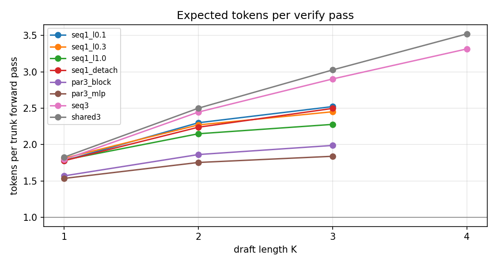
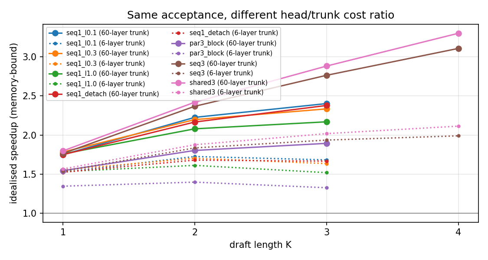

# 05 - Measuring MTP: what each design choice buys

Chapters 02-04 built the machinery; this chapter uses it to answer, with controlled runs on
one trunk and one budget, the questions people actually argue about: how large the auxiliary
loss weight should be, whether the trunk should see the MTP gradient, block vs MLP heads,
separate vs shared vs recursively reused modules, and how acceptance turns into speed. Every
number below comes from `scripts/sweep.py`; the figures from `scripts/plot_results.py`.

Code: [`scripts/sweep.py`](../scripts/sweep.py), [`scripts/plot_results.py`](../scripts/plot_results.py),
`--recursive` in [`mtp/decode.py`](../mtp/decode.py) / [`mtp/bench.py`](../mtp/bench.py).

## The four numbers, and which one you want

| metric | measured how | predicts | blind spot |
|---|---|---|---|
| teacher-forced depth-`k` accuracy (`val_acc_k`) | one forward over held-out text | greedy acceptance, roughly | ignores that decoding sees the model's *own* continuations, which are easier |
| conditional acceptance `alpha_k` | decode, count `accepted[k] / attempts[k]` | acceptance length | depends on prompt, temperature, workload |
| acceptance length / tokens per pass | `1 + sum_k prod_{j<=k} alpha_j` | speedup, given a cost model | says nothing about draft cost |
| wall-clock speedup | timer | what users feel | engine-, batch-, hardware-specific; useless from a toy model |

Papers quote all four under the name "acceptance rate". When comparing, ask which one, at what
`K`, with what sampling.

## The sweep

Nine variants, identical trunk (6 layers, `d = 256`), identical budget (800 steps, sequence 128,
batch 32, one seed), character-level TinyShakespeare. Decoding: 200 greedy characters from four
prompts, speculative output checked equal to plain greedy for every row.

```bash
python scripts/sweep.py            # ~35 min on an M1 Pro, writes runs/sweep/results.{json,md}
python scripts/plot_results.py     # writes assets/*.png
```

| variant | what it isolates |
|---|---|
| `ntp` | baseline |
| `seq1_l0.1`, `seq1_l0.3`, `seq1_l1.0` | auxiliary loss weight `lambda` for one DeepSeek-style module |
| `seq1_detach` | `lambda = 0.3` but the trunk never receives the MTP gradient (Medusa-1 regime) |
| `par3_block`, `par3_mlp` | Gloeckle block heads vs Medusa MLP heads, three depths |
| `seq3` | three *separate* sequential modules |
| `shared3` | one module trained at three depths (GLM-5 / Nemotron 3 Super) |

Sequential `D = 1` models are also decoded at `K = 2, 3` with `--recursive`, i.e. reusing the
single module at depths it was never trained for (what DeepSeek-V3 does); `seq3` is decoded at
`K = 4` the same way.

## Results

**Training-time metrics** (validation, 10 batches)

| run | val NTP loss | acc_0 | acc_1 | acc_2 | acc_3 |
|---|---|---|---|---|---|
| `ntp` | 1.514 | 0.546 | - | - | - |
| `seq1_l0.1` | 1.519 | 0.547 | 0.533 | - | - |
| `seq1_l0.3` | 1.510 | 0.548 | 0.540 | - | - |
| `seq1_l1.0` | 1.513 | 0.547 | 0.549 | - | - |
| `seq1_detach` | 1.514 | 0.551 | 0.521 | - | - |
| `par3_block` | 1.509 | 0.547 | 0.365 | 0.259 | 0.207 |
| `par3_mlp` | 1.503 | 0.548 | 0.340 | 0.241 | 0.200 |
| `seq3` | 1.505 | 0.548 | 0.527 | 0.535 | 0.549 |
| `shared3` | 1.501 | 0.550 | 0.524 | 0.535 | 0.535 |

**Decoding** (greedy, 4 prompts x 200 characters, output verified equal to plain greedy)

| run | K | conditional acceptance by depth | tokens per trunk pass |
|---|---|---|---|
| `seq1_l0.1` | 1 | 0.78 | 1.78 |
| `seq1_l0.1` | 2 (recursive) | 0.78, 0.66 | 2.30 |
| `seq1_l0.1` | 3 (recursive) | 0.78, 0.64, 0.49 | 2.52 |
| `seq1_l0.3` | 1 | 0.81 | 1.81 |
| `seq1_l0.3` | 2 (recursive) | 0.83, 0.53 | 2.27 |
| `seq1_l0.3` | 3 (recursive) | 0.85, 0.54, 0.32 | 2.45 |
| `seq1_l1.0` | 1 | 0.79 | 1.79 |
| `seq1_l1.0` | 2 (recursive) | 0.79, 0.46 | 2.15 |
| `seq1_l1.0` | 3 (recursive) | 0.78, 0.45, 0.41 | 2.28 |
| `seq1_detach` | 1 | 0.78 | 1.78 |
| `seq1_detach` | 2 (recursive) | 0.75, 0.65 | 2.24 |
| `seq1_detach` | 3 (recursive) | 0.75, 0.63, 0.60 | 2.50 |
| `par3_block` | 1 | 0.57 | 1.57 |
| `par3_block` | 2 | 0.54, 0.58 | 1.86 |
| `par3_block` | 3 | 0.56, 0.56, 0.36 | 1.99 |
| `par3_mlp` | 1 | 0.53 | 1.53 |
| `par3_mlp` | 2 | 0.49, 0.53 | 1.75 |
| `par3_mlp` | 3 | 0.50, 0.47, 0.42 | 1.84 |
| `seq3` | 1 | 0.79 | 1.79 |
| `seq3` | 2 | 0.81, 0.79 | 2.45 |
| `seq3` | 3 | 0.75, 0.85, 0.82 | 2.90 |
| `seq3` | 4 (recursive) | 0.82, 0.80, 0.84, 0.51 | 3.32 |
| `shared3` | 1 | 0.83 | 1.83 |
| `shared3` | 2 | 0.80, 0.87 | 2.50 |
| `shared3` | 3 | 0.79, 0.86, 0.82 | 3.03 |
| `shared3` | 4 | 0.82, 0.87, 0.76, 0.85 | 3.52 |




## What the sweep says

1. **The auxiliary loss weight barely moves anything at this scale.** `lambda` in
   {0.1, 0.3, 1.0} leaves the next-token loss within 0.01 nats of the baseline (1.510-1.519 vs
   1.514) and moves depth-1 accuracy by 1.6 points (0.533 -> 0.549). DeepSeek's 0.3 -> 0.1 and
   Ling's 0.1 are conservative choices for trunks that are expensive to hurt; on a small model
   there is no penalty to measure. The one place `lambda` should show up, acceptance at the
   untrained recursive depths, is dominated by noise (0.49 / 0.32 / 0.41 at depth 3), which is
   the real lesson: a `D = 1` module's behaviour on its own outputs is not something the loss
   weight controls.
2. **Joint training beats a frozen trunk for the head, and costs the trunk nothing.**
   `seq1_detach` has the same next-token loss as the baseline (1.514) and 1.9 points lower
   depth-1 accuracy than `seq1_l0.3` (0.521 vs 0.540): when the trunk receives the MTP gradient
   it arranges its states to be more predictive of the future, and here that came for free.
   This is the tension Medusa-1 (frozen) vs Medusa-2 (joint) and MuToR are about; at scale the
   "free" part is the claim under dispute, which is why `--detach-trunk` exists as a switch.
3. **A transformer block beats a residual MLP as a parallel head, by a little.** 0.365 / 0.259 /
   0.207 vs 0.340 / 0.241 / 0.200 teacher-forced accuracy at depths 1-3, and 1.99 vs 1.84 tokens
   per pass at `K = 3`. The MLP head only re-reads the single trunk vector; the block head
   attends over the whole prefix. Neither comes close to a chained module (0.53 at depth 1):
   the architecture of the head matters less than what it is conditioned on.
4. **Separate modules and a shared module tie on what they were trained for, and diverge the
   moment you go past it.** `seq3` and `shared3` have the same teacher-forced accuracy at every
   depth (0.52-0.55) and nearly the same acceptance at `K <= 3` (2.90 vs 3.03 tokens per pass).
   At `K = 4`, `seq3` has to reuse its depth-3 module on that module's own output and accepts
   51% of fourth drafts; `shared3`, which was trained to consume its own output, accepts 85%.
   The same mismatch shows up for the `D = 1` models drafted recursively: depth-2 acceptance
   0.46-0.66 against 0.79-0.87 for modules trained at depth 2. That gap - a trained-for depth
   accepting ~0.8, an untrained-for depth accepting ~0.5 - is the whole argument for the shared
   multi-depth recipe of GLM-5, Nemotron 3 Super and FastMTP, and the reason `--recursive` is an
   explicit opt-in here rather than the default.
5. **Shared weights are also cheaper.** `shared3` trains 0.94M head parameters where `seq3`
   trains 2.8M, keeps one module's KV cache per depth at inference, and reached the best
   tokens-per-pass of the sweep (3.52 at `K = 4`).
6. **None of the MTP variants hurt the next-token head.** Every MTP run's validation loss
   (1.501-1.519) brackets the baseline (1.514); the ordering within that range is single-seed
   noise. This matches the literature's shape - no quality penalty at small `lambda`, gains only
   claimed at scale - and is why this repository does not advertise MTP as a quality lever.

## The cost model, made visible

`metrics.speedup_estimate` divides tokens per pass by `1 + draft_cost`. With one block per
depth, drafting `K` tokens costs `K / n_layers` of a trunk pass. The same acceptance numbers
give very different speedups on a 6-layer toy and on a 60-layer production trunk:



This is why the README's production numbers (1.8x for DeepSeek-V3 at ~88% acceptance, ~2.6x for
MiMo-V2-Flash at acceptance length 3.6) are consistent with the acceptance rates you can measure
here, while wall-clock on the toy is not. Beyond the head/trunk ratio, real deployments add MoE
expert loading, batching effects and kernel-launch overheads; treat the dotted 6-layer lines as
the pessimistic end and the solid 60-layer lines as an upper bound.

## Exercises

1. Add a second seed to `scripts/sweep.py` (`--seed`) and report mean +- range. Which of the
   conclusions above survive?
2. Decode at `--temperature 0.8` in the sweep and compare conditional acceptance with the greedy
   numbers (chapter 04 saw sampling accept *more*). Is that still true for the parallel heads?
3. Train `seq1_l0.3` for 2400 steps and re-measure. Does the recursive-depth-2 acceptance gap to
   `shared3` shrink or grow as the module gets better at depth 1?
